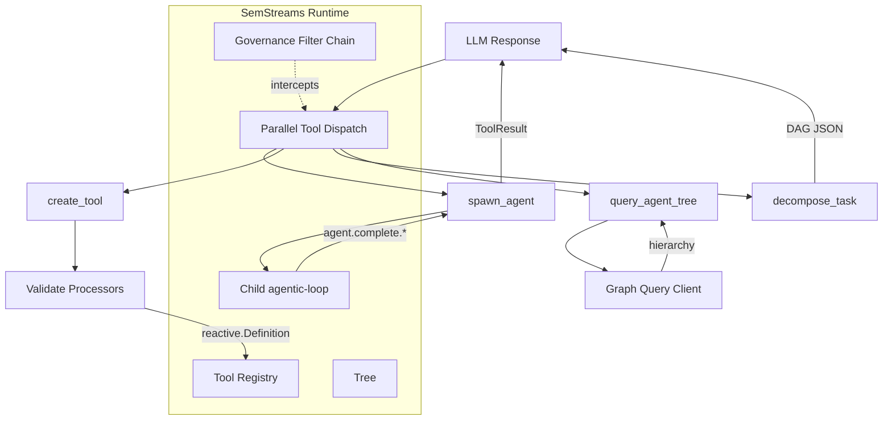

# Semsage

Semsage is a Go application that implements agentic AI workflows on top of
[SemStreams](https://github.com/C360Studio/semstreams) — a stream processor that builds semantic
knowledge graphs from event data using NATS JetStream.

The core insight is that agents are just another consumer of SemStreams flows. Tools are reactive
definitions (processors wired as `reactive.Definition`), `spawn_agent` composes flows by
instantiating child loops, `decompose_task` produces dependency graphs, the knowledge graph is
shared state, and the governance filter chain covers everything automatically. No new framework,
no DSL.

## Inspiration and Attribution

This project is a Go-native implementation of the ideas described in:

- Li et al., "OpenSage: Self-Programming Agent Generation Engine" —
  [arxiv.org/abs/2602.16891](https://arxiv.org/abs/2602.16891)
- Ian Blenke's [SageAgent](https://github.com/ianblenke/sageagent) — an open-source Python
  implementation that directly inspired this work

**How Semsage differs:** Rather than building custom infrastructure, Semsage is Go-native and
layers directly on SemStreams' existing primitives: NATS JetStream for messaging, typed payload
envelopes for polymorphic dispatch, and the governance filter chain for policy enforcement.
The agentic capabilities are `ToolExecutor` implementations and `reactive.Definition` registrations
— the same extension points available to any SemStreams application.

## How It Works

SemStreams provides the runtime: NATS JetStream subjects carry typed messages between processors,
KV buckets hold durable state, and the governance filter chain intercepts every operation.
Semsage registers additional tools and reactive definitions into that runtime.

When an agent calls `spawn_agent`, a child `agentic-loop` starts on the existing
`agent.task.*` subject space. The parent blocks via a JetStream subscription on
`agent.complete.{childLoopID}` — no polling, no new transport. If the LLM emits three
`spawn_agent` calls in one response, the existing parallel tool-call dispatch runs all three
children concurrently without any additional coordination logic in Semsage.

Agent hierarchy is tracked via SemStreams' graph layer — lightweight entity references with
relationship triples (`agentic.loop.spawned`) make the tree queryable via existing graph
infrastructure without a separate KV bucket. Mutable loop state stays in `AGENT_LOOPS`
for fast KV Watch.



## Components

| Component | Role |
|-----------|------|
| `spawn_agent` | Publishes a `TaskMessage` to create a child loop, subscribes to `agent.complete.{childLoopID}` before publishing to avoid races, blocks until the child completes or times out, and returns the result as a normal `ToolResult` |
| `create_tool` | Lets the LLM compose existing processors into named reactive definitions at runtime; validates all referenced processors exist, builds a `reactive.Definition`, and registers it as a callable tool scoped to the current agent tree |
| `decompose_task` | Returns a DAG of subtasks as structured JSON; the parent agent decides whether to spawn nodes individually or hand the DAG to an automated execution workflow |
| `query_agent_tree` | Queries the agent hierarchy via SemStreams' graph query infrastructure — tree traversal, parent/child relationships, loop state |

## UI Dashboard

A SvelteKit 2 + Svelte 5 dashboard for observing agent hierarchies in real time. It consumes
the HTTP/SSE API served by the `processor/ui-api` component.

**Routes**

| Route | Purpose |
|-------|---------|
| `/activity` | Live activity feed via SSE |
| `/loops/[id]` | Loop detail and tree view |
| `/entities` | Entity list |
| `/entities/[id]` | Entity detail |
| `/settings` | Configuration |
| Cmd+K | Chat drawer (inline agent interaction) |

**API endpoints** (served by `processor/ui-api`)

`GET /api/health`, `GET /api/activity` (SSE), `GET /api/loops`, `GET /api/loops/{id}`,
`POST /api/loops/{id}/signal`, `GET /api/loops/{id}/children`, `GET /api/loops/{id}/tree`,
`GET /api/trajectory/loops/{id}`, `GET /api/tools`, `POST /api/chat`, `POST /graphql/`

## Prerequisites

- **Go 1.25+**
- **Node.js 20+** (for the UI)
- **NATS Server 2.10+** with JetStream enabled
- **SemStreams** — available at `../semstreams` or as a Go module dependency
  ([github.com/C360Studio/semstreams](https://github.com/C360Studio/semstreams))

## Getting Started

**Backend: build and test**

```bash
go build ./...
go vet ./...
go test ./...
go test ./... -race
```

**Configure**

Semsage uses JSON configuration files following the SemStreams convention.
See `configs/semsage.json` for the default configuration.

**Run the backend**

```bash
# Start NATS with JetStream via docker compose
docker compose up -d

# Run Semsage (includes the HTTP/SSE API for the UI)
go run ./cmd/semsage
```

**UI: install dependencies**

```bash
cd ui
npm install
```

**Run the UI dev server**

```bash
# From the ui/ directory
npm run dev
```

The dev server proxies API requests to the running backend. The dashboard is available at
`http://localhost:5173` by default.

**UI: other scripts**

```bash
npm run build          # Production build (static adapter output)
npm run check          # svelte-check + TypeScript validation
npm run test           # Vitest unit tests
npm run test:e2e       # Playwright e2e tests (43 tests, no backend required)
npm run test:e2e:ui    # Playwright UI mode for debugging
```

The Playwright tests use route mocking, so no running backend is needed. On first run, install
the browser:

```bash
npx playwright install chromium
```

## Project Structure

```
semsage/
├── cmd/semsage/              # Service entry point
├── agentgraph/               # Graph entity helpers for agent hierarchy
├── processor/
│   └── ui-api/               # HTTP + SSE component serving the dashboard API
│       ├── component.go      # SemStreams processor registration
│       ├── config.go         # Configuration
│       ├── http.go           # Route handlers
│       ├── http_test.go      # 22 unit tests (race-detector clean)
│       ├── sse.go            # Server-sent events
│       └── types.go          # Shared types
├── tools/
│   ├── register.go           # Tool registration helper
│   ├── spawn/                # spawn_agent executor
│   ├── create/               # create_tool executor
│   ├── decompose/            # decompose_task executor
│   └── tree/                 # query_agent_tree executor (graph-backed)
├── ui/                       # SvelteKit 2 + Svelte 5 dashboard
│   ├── src/routes/           # App routes (activity, loops, entities, settings)
│   ├── e2e/                  # Playwright e2e tests (43 tests across 6 files)
│   └── package.json
├── workflow/dag/             # DAG execution reactive definition
├── configs/                  # Default configuration
└── docs/                     # Architectural documentation
```

## License

MIT — see [LICENSE](LICENSE).
